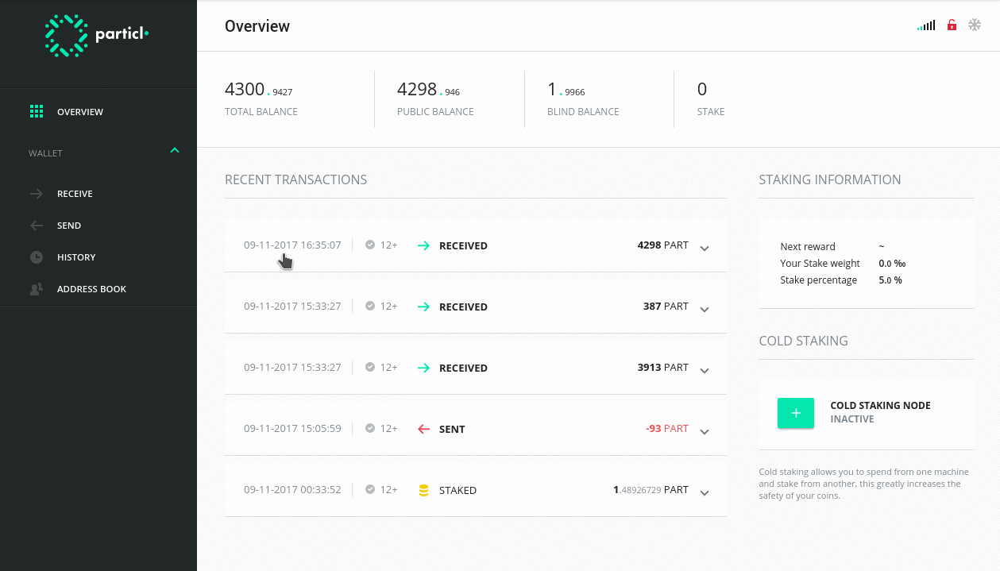

# falcon-desktop – UI



> *"Falcon is an open source project that aims to restore the balance of privacy on the internet."*

We provide a decentralized privacy platform with a suite of tools to enhance your online privacy:

* **An anonymous cryptocurrency** – send and receive the PART cryptocurrency without revealing the transaction history
* **End-to-end encrypted messaging** – communicate in a secure and decentralized manner without revealing your IP address
* **A private marketplace** – buy and sell goods without leaving a trace

This repository is the user interface that works in combination with our [`falcon-core`](https://github.com/falcon/falcon-core).

[](https://github.com/falcon/falcon-desktop/releases)

# Contribute

[](https://snyk.io/test/github/falcon/falcon-desktop)
[](https://travis-ci.org/falcon/falcon-desktop)
[](https://coveralls.io/github/falcon/falcon-desktop?branch=master)
[](https://codeclimate.com/github/falcon/falcon-desktop)
[](https://greenkeeper.io/)

> Be sure to read our [Contributing Guidelines](CONTRIBUTING.md) first

## Development

### Boostrapping for development:

* Download + Install [Node.js®](https://nodejs.org/) 6.4—7.10
* Download + Install [git](https://git-scm.com/)

```bash
git clone https://github.com/falcon/falcon-desktop
cd falcon-desktop
yarn install
```

### Development with Electron

1. run `ng serve` to start the dev server and keep it running
2. and then start it: `yarn run start:electron:dev`
   * note: this command will auto-refresh the client on each saved change
   * `-testnet` – for running on testnet (omit for running the client on mainnet)
   * `-opendevtools` – automatically opens Developer Tools on client launch
   * `-skipmarket` – skip launching internal market process

#### Interact with falcon-core daemon

You can directly interact with the daemon ran by the Electron version.

```
./falcon-cli -testnet getblockchaininfo
```

## Running

### Start Electron

* `yarn run start:electron:fast` – disables debug messages for faster startup (keep in mind using `:fast` disables auto-reload of app on code change)

### Package Electron

Building for Windows requires:
* WINE
* the 32-bit libraries to be available.

```bash
sudo apt-get install gcc-multilib
sudo apt-get install g++-multilib
```


* `yarn run package:win` – Windows
* `yarn run package:mac` – OSX
* `yarn run package:linux` – Linux

## Contributors

Join us in [#falcon-dev:matrix.org](https://riot.im/app/#/room/#falcon-dev:matrix.org) on [Riot](https://riot.im)
